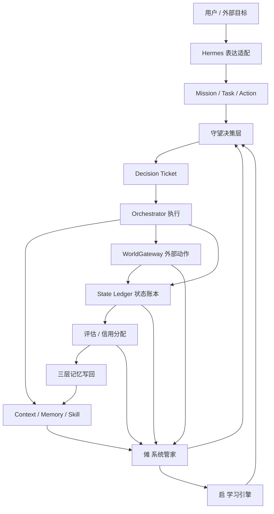

# KUN-V4 产品方案

> 日期：2026-04-29
>
> V4 不是推翻 V3。V4 是把 V3 的模块收束成一个真正能自我诊断、自我复盘、自我优化、对真实世界负责的系统。

## 0. 先说结论

KUN 的核心不是“很多 agent”，也不是“自进化听起来很厉害”。

KUN 的核心是：

> 用户给一个真实目标，KUN 用最合适的策略、最合适的模型、最合适的 context、最合适的 skill、最合适的外部动作，把事情做成，并且知道自己为什么做成或为什么没做成。

V4 的重点是补齐这个闭环：

```text
目标进入
  ↓
守望生成决策票据
  ↓
Orchestrator 执行
  ↓
State Ledger 记账
  ↓
评估和信用分配
  ↓
Memory / Context / Capability 写回
  ↓
傩做系统体检和瘦身
  ↓
启从真实问题里生成实验
  ↓
守望审批新策略是否进入生产
```

这条链路如果断掉，系统就会退化成“很多模块都存在，但没有真正协作”。

## 1. 外部研究和行业参照

这部分不是照搬，而是用来校准 KUN 的方向。

### 1.1 Agent 不该一上来就复杂化

Anthropic 的 agents 工程建议强调：能用 workflow 解决的任务，不要强行上复杂 agent；只有需要自主判断和动态行动时，才让 agent 接管更多自由度。

对 KUN 的启发：

- 简单任务必须走快路径。
- 复杂任务才走深路径。
- 高风险任务走安全路径。
- 多 agent 不是荣誉，任务效果才是核心指标。

### 1.2 OpenAI Agents SDK 的方向

OpenAI Agents SDK 把工具、guardrails、tracing、handoff、computer use 等能力组合成 agent 应用底座。

对 KUN 的启发：

- KUN 不能只会“对话”，必须有可追踪的执行链。
- 外部动作必须有 guardrails。
- trace 只是第一步，KUN 还要做到从 trace 进入诊断、修复、学习。

### 1.3 MCP / A2A / AP2 的方向

MCP 解决模型和工具、资源、上下文的标准连接。A2A 解决 agent 和 agent 的结构化协作。AP2 这类支付协议强调真实世界动作里的授权、意图、凭证和可追责。

对 KUN 的启发：

- Hermes 必须是全链路适配层，不只是最终回复美化。
- WorldGateway 必须把真实动作变成有权限、有审计、有补偿、有确认的动作。
- 对外部 agent、人类、企业、API，不能全靠自然语言。

### 1.4 LangGraph / Temporal 的方向

LangGraph 和 Temporal 都强调长周期、可恢复、可中断、可观察的执行流。

对 KUN 的启发：

- Mission 不能只存在于对话里。
- 长周期任务必须能 checkpoint、恢复、失败重试、人工介入。
- State Ledger 必须支持当前状态快读和历史事件回放。

### 1.5 LangSmith / Phoenix / Langfuse 的方向

这些系统重点解决 LLM trace、observability、evaluation。

对 KUN 的启发：

- KUN 必须有自己的可观测系统。
- 但 KUN 不能止步于观测。KUN 要从观测进入傩诊断、守望决策、启实验和记忆写回。

### 1.6 OWASP / NIST 的方向

LLM 和 agent 系统的风险重点包括越权、数据泄漏、提示注入、工具滥用、过度代理、供应链风险、不可控外部动作。

对 KUN 的启发：

- WorldGateway 必须是所有外部动作的唯一出口。
- NUO 必须持续体检权限、密钥、租户、外部 handler、补偿策略。
- 不能把“能调工具”当成“安全能执行”。

### 1.7 Voyager / Reflexion / MemGPT / Generative Agents 的方向

这些工作证明了几件事：

- skill 和记忆可以让 agent 越用越强。
- 反思和复盘能提升后续任务表现。
- 长期记忆必须有检索、压缩、遗忘和摘要。
- 只存流水账不够，必须把经验变成可复用方法。

对 KUN 的启发：

- 启必须从真实执行问题中学习。
- 记忆必须分结果记忆、过程记忆、元决策记忆。
- 最值钱的是元决策记忆：为什么选这个模型、这个路径、这个 skill、这个外部动作。

## 2. V4 的一句话定位

KUN 是一个“真实问题解决系统”：

> 它不是等用户一步步发命令，而是围绕用户目标，持续规划、执行、监控、交付、复盘、学习，并且能安全地和真实世界交互。

更大白话：

> KUN 要先能帮我把事做成，然后越来越知道怎么更快、更稳、更省地做成。

## 3. V4 的核心产品原则

1. 任务效果第一，速度第二，成本第三。
2. 简单任务快跑，复杂任务深跑，高风险任务稳跑。
3. 自进化必须让用户感知到成长，但不能抢走交付主线。
4. 傩是整个系统的管家，不只是 agent 管家。
5. 守望是决策层，不能下场踢球。
6. 启是学习引擎，必须从真实问题里长出来。
7. WorldGateway 是真实世界动作的唯一出口。
8. Hermes 是全链路表达和协议适配层。
9. 所有重要判断必须变成 Decision Ticket。
10. 所有新功能必须有调用方、消费者、效果和测试。

## 4. V4 系统总图



### 模块分工

| 模块 | 一句话职责 | 不能做什么 |
| --- | --- | --- |
| Hermes | 把信息翻译成不同对象能用的格式 | 不能替代执行和审批 |
| 守望 | 生成决策票据，决定策略和风险门 | 不能亲自执行业务 |
| Orchestrator | 执行任务，调度步骤 | 不能绕过守望和 WorldGateway |
| WorldGateway | 执行或准备真实世界动作 | 不能无审计外发 |
| State Ledger | 记录当前状态和历史事件 | 不能自己做业务决策 |
| Memory / Context | 存储和检索可复用经验 | 不能乱存流水账 |
| 启 | 做实验，找更优策略 | 不能直接改生产策略 |
| 傩 | 体检、诊断、瘦身、风险发现 | 不能绕过守望直接改核心策略 |

## 5. V4 最重要的新增：系统循环契约

KUN 的每个核心模块都必须回答 7 个问题：

1. 我接收什么输入？
2. 我输出什么结果？
3. 谁消费我的结果？
4. 我影响哪个决策？
5. 我失败了谁知道？
6. 我产生的数据怎么进入复盘和学习？
7. 傩怎么诊断我是否真的有用？

没有这 7 个答案，就不算 V4 合格模块。

### 示例

| 模块 | 输入 | 输出 | 消费者 | 傩怎么检查 |
| --- | --- | --- | --- | --- |
| ContextPacker | task + strategy + memory | context pack | LLM / skill | 是否相关、是否冗余、是否影响结果 |
| WorldGateway | approved action | 执行结果 / 草稿 / dry-run | StateLedger / 用户 / Memory | handler 失败率、风险、补偿、密钥 |
| ValueGate | step plan + budget + value history | continue / skip / stop / escalate | Orchestrator | 是否真的省成本，是否误杀好路径 |
| Qi | 真实失败 / 低效 / 高成本信号 | 实验候选策略 | 守望 / Lab | 是否基于真实问题，是否有实验数据 |

## 6. 傩：整个 KUN 的系统管家

V4 必须把傩从“agent 管家”升级为“KUN 系统管家”。

### 6.1 傩诊断对象

傩要覆盖 8 类对象：

1. **Agent 和角色模板**
   - 成功率。
   - 成本。
   - 响应慢不慢。
   - 是否经常走偏。
   - 是否适合当前任务类型。

2. **Context**
   - 是否相关。
   - 是否重复。
   - 是否过期。
   - 是否污染。
   - 是否压缩失真。
   - 是否被错误注入。

3. **Memory**
   - 哪些记忆真的被复用。
   - 哪些记忆只是流水账。
   - 哪些记忆应该合并、降权、遗忘。
   - 哪些记忆应该永久保留。

4. **Skill**
   - 哪些 skill 失败率高。
   - 哪些 skill 成本高但贡献低。
   - 哪些 skill 经常被误召回。
   - 哪些 skill 缺少测试和权限声明。

5. **工程链路**
   - Orchestrator 有没有消费守望决策。
   - State Ledger 有没有记录关键节点。
   - 事件有没有消费者。
   - 预算、验证、恢复、调度有没有闭环。

6. **agent 协作**
   - 多 agent 是否真的提升结果。
   - 是否重复劳动。
   - 是否互相冲突。
   - 交接信息是否足够。
   - 是否该合并成单 agent 快跑。

7. **WorldGateway**
   - handler 是否可靠。
   - 密钥是否配置。
   - allowlist 是否正确。
   - 是否有补偿策略。
   - 是否真的外发。
   - 是否需要人工确认。

8. **策略系统**
   - Strategy Pack 是否命中准确。
   - 模型路由是否划算。
   - evaluator 是否真的影响执行。
   - credit assignment 是否能解释成功来源。

### 6.2 傩的四个层次

| 层次 | 作用 | 用户是否默认看到 |
| --- | --- | --- |
| 健康检查 | 任务是否卡住，系统是否异常 | 是 |
| 风险检查 | 权限、外部动作、安全、租户 | 是 |
| 成本检查 | 哪些模型、任务、策略在烧钱 | 是 |
| 深度体检 | context 瘦身、记忆遗忘、协作优化、策略复盘 | 默认折叠 |

### 6.3 傩的标准链路

```text
傩发现问题
  ↓
生成体检报告 / 修复建议 / 瘦身建议
  ↓
守望判断是否允许执行
  ↓
需要用户确认则进入 NUO 权限入口
  ↓
对应模块执行
  ↓
State Ledger 记录
  ↓
Memory 写回“修了什么、效果如何”
```

### 6.4 傩不能变成什么

傩不能变成另一个“什么都自己干”的超级模块。

傩负责：

- 发现问题。
- 解释问题。
- 提建议。
- 触发审批。
- 复盘效果。

傩不负责：

- 直接绕过守望改策略。
- 直接绕过 WorldGateway 执行外部动作。
- 直接删除用户重要记忆。
- 直接改变生产协议。

## 7. WorldGateway 风险和好坏评估

V4 必须给 WorldGateway 加 handler 体检。

每个 handler 要有一张健康卡：

```json
{
  "handler_id": "email.send.v1",
  "status": "limited",
  "static_risk": "high",
  "dynamic_risk": "medium",
  "configured": true,
  "tenant_secret_ok": true,
  "requires_human_approval": true,
  "has_allowlist": true,
  "has_compensation": false,
  "external_dispatch": true,
  "success_rate_7d": 0.92,
  "failure_rate_7d": 0.08,
  "approval_reject_rate_7d": 0.31,
  "timeout_count_7d": 2,
  "last_incident": "smtp_429",
  "recommendation": "继续允许草稿和人工确认发送，但禁止自动发送"
}
```

### 7.1 静态风险

静态风险来自 handler 描述：

- 是否真实外发。
- 是否不可逆。
- 是否需要密钥。
- 是否需要 allowlist。
- 是否有人类审批。
- 是否有补偿策略。
- 是否可能影响钱、公开发布、客户、企业系统。

### 7.2 动态风险

动态风险来自运行结果：

- 最近失败率。
- 最近超时率。
- 最近审批拒绝率。
- 最近补偿次数。
- 最近重复外发风险。
- 最近安全拦截次数。
- 最近租户密钥错误。

### 7.3 傩可以下发的建议

| 情况 | 建议 |
| --- | --- |
| 没密钥 | 标记未配置，提示用户配置 |
| 没补偿策略 | 限制为 dry-run 或草稿 |
| 失败率高 | 降级为人工确认 |
| 外发风险高 | 禁止自动执行 |
| approval reject 高 | 提醒策略/文案不可靠 |
| allowlist 异常 | 立刻阻断 |
| 重复外发风险 | 强制幂等键和二次确认 |

## 8. 守望：统一决策票据

现在代码里有多个判断点：

- ExecutionMode。
- ValueGate。
- ProtocolRegistry。
- TaskRouter。
- PreDeliverGate。
- 模型路由。
- WorldGateway policy。
- Budget guard。
- capability card。
- memory reuse hint。

这些模块可以独立存在，但最终必须汇总成一张 Decision Ticket。

### 8.1 Decision Ticket 最小字段

```json
{
  "ticket_id": "dt_xxx",
  "task_id": "task_xxx",
  "mission_id": "mission_xxx",
  "strategy_pack": "product_ops",
  "execution_path": "deep",
  "risk_path": "safe",
  "agent_formation": ["operator", "researcher", "reviewer"],
  "model_plan": {
    "intent": "gpt-5.5",
    "execution": "gpt-5.5",
    "judge": "small_judge"
  },
  "context_plan": {
    "packs": ["product_memory", "commercialization_methodology"],
    "max_items": 8,
    "compression": "summary_first"
  },
  "skill_plan": ["market_research", "copywriting", "world_gateway.email_draft"],
  "world_plan": {
    "allowed_handlers": ["email.draft", "local_file.write"],
    "blocked_handlers": ["payment.send"],
    "approval_required": true
  },
  "budget": {
    "max_cost_usd": 3.0,
    "max_time_sec": 1800,
    "branches": 3
  },
  "evaluators": ["success", "risk", "cost", "reuse_value"],
  "stop_rules": ["cost_overrun", "low_value", "external_risk"],
  "reason": "同类商业化任务历史上深路径收益更高，且存在外部协作风险"
}
```

### 8.2 Decision Ticket 的消费者

| 消费者 | 用它做什么 |
| --- | --- |
| Orchestrator | 执行路线 |
| ContextPacker | 拉什么 context |
| ModelRouter | 用什么模型 |
| SkillRouter | 选什么 skill |
| WorldGateway | 允许哪些外部动作 |
| StateLedger | 记录为什么这么做 |
| MemoryWriteback | 写回元决策记忆 |
| NUO | 给用户解释和诊断 |
| Qi | 作为实验和优化的数据 |

如果某个判断没有进入 Decision Ticket，它就可能变成隐藏逻辑，后面很难复盘。

## 9. 系统级 MoE：KUN 的核心工程优势

V4 继续保留“系统级 MoE”，但要讲清楚它不是炫技。

系统级 MoE 的目标是：

> 不同任务只唤醒它真正需要的能力。

### 9.1 稀疏激活对象

一次任务可以稀疏激活：

- 策略包。
- context 集合。
- 记忆类型。
- skill。
- agent 阵型。
- 模型档位。
- evaluator。
- WorldGateway handler。
- 风险规则。
- 人工确认门。

### 9.2 三条路径

| 路径 | 用于什么任务 | 特点 |
| --- | --- | --- |
| 快路径 | 低风险、清晰、常见 | 少 context、少评估、快速交付 |
| 深路径 | 复杂、模糊、长周期 | 多步骤、多记忆、多评估、可纠偏 |
| 安全路径 | 外部动作、高风险、不可逆 | 权限门、审计、补偿、人工确认 |

### 9.3 为什么这是壁垒

普通 agent 系统常见问题是：

- 所有任务都差不多跑。
- 简单任务拖慢。
- 复杂任务浅尝辄止。
- 高风险任务没有足够护栏。
- 失败后不知道是哪个策略错了。

KUN 的优势应该是：

- 更懂什么时候快。
- 更懂什么时候深。
- 更懂什么时候慢下来保安全。
- 更懂什么时候多 agent，什么时候单 agent。
- 更懂什么时候用强模型，什么时候用便宜模型。
- 更懂哪些 context 有用，哪些会干扰。

## 10. 启：从真实问题里进化

启不是后台自嗨的实验室。启的题目必须来自真实系统信号。

### 10.1 启的输入

启应该消费：

- 傩发现的系统问题。
- 守望的错误决策。
- WorldGateway 的失败 handler。
- StateLedger 里的失败任务。
- 用户不满意的结果。
- 高成本低收益的模型路径。
- 低贡献 context。
- memory 复用失败案例。
- credit assignment 无法归因的任务。

### 10.2 启的输出

启可以产出：

- 新 Strategy Pack 候选。
- 新路由规则候选。
- 新 evaluator 候选。
- 新 prompt template 候选。
- 新 skill 组合候选。
- 新 WorldGateway policy 候选。
- context 瘦身规则候选。

### 10.3 启的准入

启产出的东西不能直接进生产。

准入链路：

```text
实验候选
  ↓
离线回放
  ↓
影子模式
  ↓
小流量金丝雀
  ↓
守望批准
  ↓
进入稳定策略
```

### 10.4 重要红线

如果启的分数只是“LLM 回答长度”“看起来完整”“自评不错”，不能作为生产证据。

启必须拿真实指标说话：

- 同类任务成功率是否提升。
- 成本是否下降。
- 用户满意度是否提高。
- 风险是否下降。
- 失败率是否降低。
- 是否通过回放测试。

## 11. State Ledger：从当前状态到长期账本

V4 要把 State Ledger 明确分三层：

| 层 | 作用 | 性能要求 |
| --- | --- | --- |
| 热状态 | 当前任务在干什么 | 快 |
| 事件日志 | 发生过什么 | 可回放 |
| 长期账本 | 为什么这么做，结果如何 | 可审计、可复盘 |

### 11.1 用户看什么

用户只需要看到：

- 当前目标。
- 当前步骤。
- 当前风险。
- 当前预算。
- 当前待确认。
- 下一步动作。
- 最近重要事件。

### 11.2 LLM 看什么

LLM 需要结构化看到：

- 当前任务状态。
- 已完成步骤。
- 决策票据。
- 可用 context。
- 最近失败。
- 约束和风险。

### 11.3 傩看什么

傩需要看：

- 哪些任务卡住。
- 哪些任务反复失败。
- 哪些事件没人消费。
- 哪些模块没有写回。
- 哪些恢复逻辑没跑。
- 哪些风险被发现但没人处理。

## 12. Memory 和 Context：从存储到策略资产

V4 不允许记忆变成垃圾堆。

### 12.1 三层记忆

1. **结果记忆**
   - 任务成没成。
   - 用户满不满意。
   - 最终交付质量。

2. **过程记忆**
   - 用了什么步骤。
   - 哪一步卡住。
   - 哪个 skill 有效。
   - 哪个外部动作失败。

3. **元决策记忆**
   - 为什么选这个模型。
   - 为什么选这个策略包。
   - 为什么打开多 agent。
   - 为什么触发人工确认。
   - 为什么停止或继续。

### 12.2 Context 选择必须吃信用分配

ContextPacker 不能只看关键词。

最终应该综合：

- 语义相关。
- 访问频率。
- 近期性。
- 任务依赖。
- 用户 pin。
- 历史贡献度。
- 风险和可信度。
- 当前 Strategy Pack。

### 12.3 傩要做记忆瘦身

傩定期输出：

- 哪些记忆要强化。
- 哪些记忆要压缩成方法论。
- 哪些记忆要降权。
- 哪些记忆要遗忘。
- 哪些记忆要人工确认才能删。

## 13. Agent 协作：允许 agent，但不崇拜 agent 数量

V4 的 agent 观：

> Agent 是可组装执行体，不是固定员工表。

一个 agent 可以由这些东西组成：

- 任务目标。
- 当前 context。
- 模型。
- skill。
- WorldGateway 权限。
- 预算。
- 风险规则。
- 记忆和能力卡。

多 agent 只在这些情况下开启：

- 任务天然可并行。
- 多视角能明显提高质量。
- 需要 reviewer / judge / executor 分离。
- 单 agent 历史成功率低。
- 高风险任务需要互相校验。

多 agent 不适合：

- 简单任务。
- 明确规则任务。
- 低价值任务。
- 信息不够但可以先问用户的任务。

傩必须诊断：

- 多 agent 是否提升结果。
- 多 agent 是否浪费成本。
- 是否有重复执行。
- 是否有决策冲突。
- 是否有权限冲突。

## 14. Hermes：全链路表达适配

Hermes 的职责不是“把最终回答写好看”。

Hermes 要管理：

- 对用户说大白话。
- 对 LLM 给结构化上下文。
- 对 skill 给明确输入输出契约。
- 对 API 给严格字段。
- 对外部 agent 给协议包。
- 对企业或人类协作者给邮件、表单、审批单、报告。

V4 的原则：

> 同一件事，对不同对象用不同语言，但底层事实必须来自同一份 State Ledger 和 Decision Ticket。

## 15. 用户主体验

主入口不要做成节点图。

主入口应该是：

```text
对话框
任务看板
待确认动作
成本和风险
下一步
```

### 15.1 首页第一屏

用户打开 KUN，5 秒内应该知道：

- KUN 正在做什么。
- 哪个任务卡住。
- 花了多少钱。
- 哪里需要我确认。
- 下一步是什么。
- 有没有风险。

### 15.2 节点图的位置

节点图适合：

- 高级调试。
- 长任务可视化。
- 工作流模板编辑。
- 回放和复盘。

节点图不适合做普通用户主入口。

## 16. 诚实边界和伪功能审计

V4 继续坚持：

- 只加字段不算完成。
- 只 emit 事件不算完成。
- 没消费者不算完成。
- 没主流程调用不算完成。
- 没测试不算完成。
- 没写诚实边界不算完成。

### 16.1 能力状态

每个能力必须标：

| 状态 | 含义 |
| --- | --- |
| ready | 主流程已接、用户可用、有测试 |
| partial | 有主流程，但能力有限 |
| audit_only | 只记录和审计，不真实执行 |
| prototype | 原型，不能宣传成产品能力 |
| not_ready | 不可用 |

### 16.2 傩要自动检查伪功能

傩应该定期检查：

- 有事件但无消费者。
- 有 API 但无人调用。
- 有字段但无人读取。
- 有文档承诺但无代码证据。
- 标 ready 但无测试。
- 标 ready 但运行时未安装。

## 17. 当前代码深度审视

下面是基于当前代码的诚实判断。

### 17.1 已经比较扎实的部分

1. 守望决策层已经接入 Orchestrator。
2. Strategy Pack 能影响 execution_mode、context_limit、skill hints。
3. State Ledger 已经能提供当前状态热视图。
4. Hermes 已经开始进入 LLM prompt 和 skill I/O。
5. WorldGateway 已经有 handler、权限、预览、审批、部分真实执行和真实外发 handler。
6. Mission worker 已经能接 Orchestrator runner 做 continuation。
7. NUO 页面已经有健康、成本、权限、风险、能力边界入口。
8. Delivery Status 已有 API 和 CLI，可直接检查 ready / partial / not_ready，防止伪功能。
9. State Ledger 已有当前热视图、EventRow 历史回放、任务 story 摘要。
10. WorldGateway handler 健康、半启用真实 handler 配置、resource credit top 贡献资源已经进入傩/ops 视图。

### 17.2 还不能吹成完整闭环的部分

1. **傩诊断数据源仍要继续加深**
   - 已经有系统健康、WorldGateway handler health、context maintenance、resource credit、StateLedger 风险入口。
   - 还要继续把这些诊断结果变成更稳定的自动降级、限权、瘦身、回滚动作。

2. **傩修复仍偏占位**
   - fix_handlers 主要是 in-memory 标记和 audit log。
   - 还没有真正操作 AssetStore、Context 瘦身、WorldGateway 禁用、策略回滚。

3. **ContextPacker 还没吃中央重要度和信用分配**
   - 现在主要是关键词和 tag 打分。
   - ImportanceScorer 更完整，但主 pack 路径还没完全用上。

4. **CreditAssignment 已可观测，但还需要真实样本校准**
   - 资源信用已持久化，也能通过傩/CLI 查看 top 贡献资源。
   - 但模型、skill、context、WorldGateway handler 的路由权重还需要真实 dogfood 样本校准阈值。

5. **启的探索还不够真实**
   - 当前有些探索分数仍偏启发式。
   - 必须改成从真实失败、低效、高风险、高成本案例里产生实验。

6. **WorldGateway 还缺租户级真实生产治理**
   - handler 体检、配置缺口、失败率、补偿策略已经能被傩/ops 看到。
   - SMTP / 企业 API / 浏览器白名单已支持租户级 env 覆盖，傩体检和 preflight 也能识别。
   - 但这还不是完整 Secret Manager；密钥轮换、租户自助配置、支付/公开发布动作、补偿演练还没完成。

7. **State Ledger 仍不是完整事件溯源系统**
   - 当前已有热状态、历史事件回放、任务 story 摘要。
   - 但还不能从事件完整重建所有业务对象，也还没有跨 Mission 的长期运营故事线。

8. **Decision Ticket 已经进入很多关键路径，但仍需收尾**
   - ProtocolRegistry、TaskRouter、模型路由、ContextPacker、SkillSelector、ValidationPipeline、BudgetTracker、PreDeliverGate、WorldGateway policy 已进入票据或信用记录。
   - ValueGate、部分启实验、部分长期 Mission 策略调整还需要继续统一票据化。

## 18. V4 开发阶段

### V4-0：产品和代码诚实对齐

目标：

- 更新产品方案。
- 更新实装审计。
- 标清楚哪些是真闭环，哪些是第一版骨架。

验收：

- 所有核心能力有 ready / partial / audit_only / prototype / not_ready。
- PR 不能把 partial 写成 ready。

### V4-1：Decision Ticket 一等公民

目标：

- 建 `DecisionTicket` 数据模型。
- Watchtower、ProtocolRegistry、ValueGate、ModelRouter、PreDeliverGate、WorldGateway policy 的关键判断汇总进去。
- Orchestrator 执行时使用同一张票据。

验收：

- 每个任务至少有一张 ticket。
- StateLedger 能查到 ticket。
- Memory 能写回 ticket 的元决策。
- NUO 能用大白话解释 ticket。

### V4-2：傩系统级体检器

目标：

- 建 `SystemHealthCollector`。
- 收集 StateLedger、EventRow、WorldGateway、Context、Memory、Capability、Mission、Watchtower、Qi 的健康数据。
- 输出系统健康报告。

验收：

- 傩能回答：哪个模块有问题，为什么，影响什么，建议怎么处理。
- 能发现至少 3 类真实问题：卡住任务、缺消费者事件、高风险 WorldGateway handler。

### V4-3：WorldGateway Handler 体检

目标：

- 为每个 handler 生成健康卡。
- 计算静态风险和动态风险。
- 根据风险给出限制建议。

验收：

- `email.send`、`browser.execute`、`enterprise_api.post` 等真实外发 handler 必须显示风险。
- 缺密钥、缺 allowlist、缺补偿策略必须能被傩发现。

### V4-4：Context / Memory 瘦身闭环

目标：

- ContextPacker 接入 ImportanceScorer 和信用分配。
- NUO 生成瘦身建议。
- 守望审批后执行压缩、降权、遗忘。

验收：

- 同类重复记忆能被建议合并。
- 低贡献 context 能被建议降权。
- 用户 pin 和永久记忆不会被误删。

### V4-5：启从真实问题学习

目标：

- 启的实验队列来自真实系统问题。
- 不再主要依赖通用 seed prompt。
- 实验结果进入 shadow / canary / stable 生命周期。

验收：

- 一个 NUO finding 能生成一个 Qi experiment。
- 一个 experiment 必须有回放或影子测试证据。
- 没证据不能 promote。

### V4-6：协作冲突诊断

目标：

- 傩诊断多 agent 和多任务协作问题。
- 发现重复执行、资源冲突、权限冲突、交接信息不足。

验收：

- 能识别两个任务争同一资源。
- 能识别多 agent 没带来收益。
- 能建议合并、暂停、串行化或升级人工确认。

### V4-7：长期 Mission 产品化

目标：

- Mission 不只是能续跑，而是能长期运营。
- 支持周期复盘、预算、下一步、失败恢复、里程碑。

验收：

- 能跑一个跨 3 天 dogfood Mission。
- 每天有复盘。
- 有至少一次策略调整。
- 有至少一次用户确认外部动作。

### V4-8：生产级管控

目标：

- 账号。
- 租户。
- 密钥管理。
- 备份恢复。
- 线上监控。
- dogfood 发布门禁。

验收：

- 去掉生产默认租户 fallback。
- 外部动作密钥按租户隔离。
- 备份恢复流程跑通。
- CI 能防 ready 伪标。

### 18.9：当前代码推进状态（2026-04-30）

已经推进：

- `kun ops delivery-status`：一条命令看清哪些能承诺、哪些只是 partial。
- `kun ops dogfood --include-db-mission`：可显式跑真实数据库 Mission 续跑 smoke。
- `kun ops preflight`：会阻断“真实外部 handler 开关已开但 env/密钥没配全”的半启用状态。
- `kun ops secret-audit` 和 `/nuo/health/secret-audit`：可检查默认数据库密码、认证密钥轮换、对象存储默认密钥、真实外部 handler 半配置。
- `kun ops readiness`：把 preflight、secret-audit、delivery-status 和可选 dogfood 汇成一份正式测试报告。
- `/nuo/health/resource-credit` 和 `kun ops credit-report`：可查看 memory / skill / model / decision 等资源的持久贡献信用。
- `/api/blackboard/state-ledger/{task_id}/story`：可把某个任务的长期事件历史压成可读故事线。
- `POST /api/auth/signup`：默认关闭的邀请码注册入口，可创建租户账本、owner 和 access+refresh 会话；这不是密码登录 / OAuth。
- `/api/auth/session/me` 和 `/api/auth/session/tokens`：用户可查看当前会话和自己的 token 账本，并撤销自己的 token；仍不是完整设备风控。
- `POST /nuo/accounts/members/invite`：可写入成员邀请账本；不会伪装成已经发出邀请邮件或完成成员登录。
- `kun ops dogfood --include-db-account`：可显式跑账号账本、refresh session、成员邀请的真实 DB smoke。

仍不能承诺：

- 不能说 KUN 已经能无人长期运营一个产品。现在是 Mission 续跑闭环和 DB smoke，不是跨周真实运营验证。
- 不能说 WorldGateway 已有完整真实世界能力。邮件、浏览器、企业 API 已有 opt-in handler，但支付、公开发布、租户密钥治理、补偿演练仍未完成。
- 不能说生产级部署完成。密码/OAuth、设备指纹和异常登录风控、邀请接受和邮件发送、集中密钥管理、线上备份恢复演练仍是缺口。

## 19. V4 最小可测试产品形态

V4 做完第一阶段后，用户能这样用：

1. 在对话框里说一个目标。
2. KUN 创建 Mission。
3. 守望生成 Decision Ticket。
4. KUN 执行第一批 Task。
5. 用户在任务看板看到进度、预算、风险、待确认。
6. 外部动作进入 WorldGateway。
7. 用户批准低风险动作。
8. State Ledger 记录过程。
9. 任务结束后 Memory 写回结果、过程、元决策。
10. 傩定期体检，发现低效或风险。
11. 启基于真实问题生成实验。
12. 守望决定实验是否进入影子测试。

这才是 KUN 的产品闭环。

## 20. 不做什么

V4 暂时不追求：

- 全自动支付。
- 无人审批公开发布。
- 给所有用户开放复杂节点图。
- 把启的所有实验暴露给用户。
- 用很多 agent 假装高级。
- 只做漂亮 UI 不打通主流程。
- 把 audit_only 能力说成 ready。

## 21. 参考资料

这些资料用于校准 V4，不代表 KUN 要照搬：

- Anthropic: [Building effective agents](https://www.anthropic.com/engineering/building-effective-agents)
- OpenAI: [Agents SDK 文档](https://platform.openai.com/docs/guides/agents-sdk)
- OpenAI: [Agents SDK evolution](https://openai.com/index/the-next-evolution-of-the-agents-sdk/)
- Model Context Protocol: [官方文档](https://modelcontextprotocol.io/)
- Google Developers Blog: [Agent2Agent protocol](https://developers.googleblog.com/en/a2a-a-new-era-of-agent-interoperability/)
- Google: [Agent Payments Protocol](https://developers.googleblog.com/en/announcing-agents-to-payments-ap2-protocol/)
- LangGraph: [官方文档](https://langchain-ai.github.io/langgraph/)
- Temporal: [Durable execution](https://temporal.io/durable-execution)
- OWASP: [Top 10 for LLM Applications](https://owasp.org/www-project-top-10-for-large-language-model-applications/)
- NIST: [AI Risk Management Framework](https://www.nist.gov/itl/ai-risk-management-framework)
- Voyager: [Open-ended Embodied Agent with LLMs](https://arxiv.org/abs/2305.16291)
- Reflexion: [Language Agents with Verbal Reinforcement Learning](https://arxiv.org/abs/2303.11366)
- MemGPT: [Towards LLMs as Operating Systems](https://arxiv.org/abs/2310.08560)
- Generative Agents: [Interactive Simulacra of Human Behavior](https://arxiv.org/abs/2304.03442)
- LangSmith: [Evaluation and observability](https://docs.smith.langchain.com/)
- Arize Phoenix: [LLM observability](https://phoenix.arize.com/)
- Langfuse: [LLM engineering platform](https://langfuse.com/)
