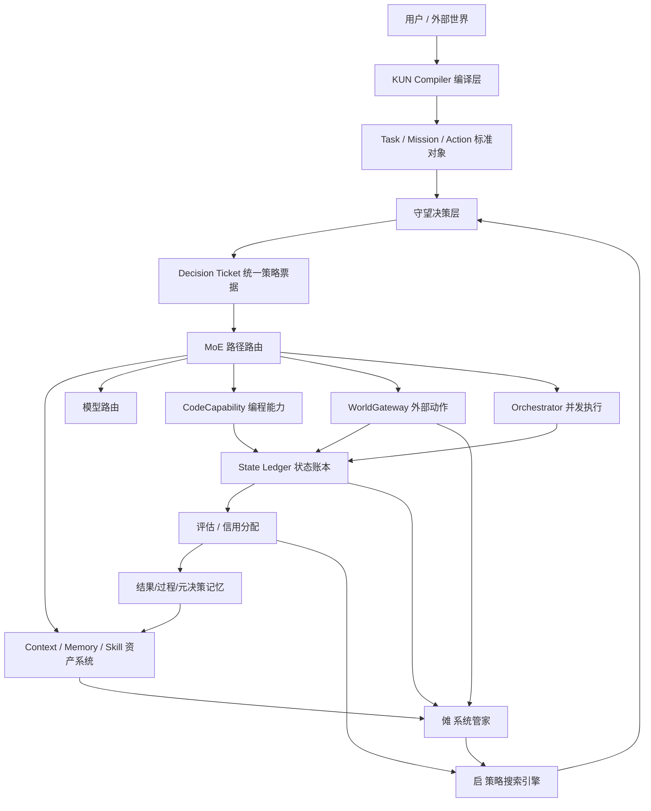

# KUN-V5 产品方案

> 日期：2026-05-01
>
> V5 不是推翻 V4。V4 把系统闭环立起来，V5 要把这个闭环升级成“会选择最佳策略的工程系统”：输入先被编译，任务先被分级，记忆先被决策，能力按需稀疏激活，启在后台不断搜索更优解，傩持续体检和瘦身，守望统一下发策略票据。

## 0. 一句话定位

KUN 是一个真实问题解决系统。

它的目标不是“开很多 agent”，也不是“堆很多模块”，而是：

> 用户给一个真实目标，KUN 能判断这件事该怎么做、要用哪些模型、哪些记忆、哪些 skill、哪些外部动作、要不要多路径搜索、要不要人工确认，然后用尽可能少的资源把事情做成，并且把为什么这么做、做得好不好、下次怎么更好都记下来。

更大白话：

> KUN 要像一个越来越会干活的组织，不只是一个会聊天的模型。

## 1. V5 相比 V4 的核心升级

V4 的核心是“闭环”：

```text
目标 -> 守望决策 -> 执行 -> 状态账本 -> 评估 -> 记忆写回 -> 傩体检 -> 启实验
```

V5 的核心是“策略选择能力”：

```text
目标进入
  ↓
资料和意图先被编译成 KUN 内部标准格式
  ↓
守望生成统一决策票据
  ↓
按任务类型稀疏激活 MoE 路径
  ↓
决定是否用记忆、用哪类记忆、用多少
  ↓
决定是否多路径、是否并发、是否沙箱、是否人工确认
  ↓
执行和外部交互
  ↓
State Ledger 记录全过程
  ↓
评估和信用分配写回
  ↓
傩定期诊断、压缩、遗忘、瘦身
  ↓
启用本地模型和强模型持续搜索更优策略
```

V5 的判断标准：

1. 简单任务必须快。
2. 复杂任务必须深。
3. 高风险任务必须稳。
4. 长周期任务必须能恢复、能复盘、能调整。
5. 新功能必须被主流程真实使用，不能只存在于文件里。
6. 自进化要让用户感知到成长，但不能牺牲交付可靠性。

## 2. 外部参照和 KUN 的取舍

### 2.1 MarkItDown 只能做资料入口，不能等同于 KUN 编译器

Microsoft MarkItDown 是很好的资料入口工具。它能把 PDF、Word、PowerPoint、Excel、HTML、图片、音频等转成 Markdown，定位就是给 LLM 和文本分析管道使用。它也提醒：转换工具会以当前进程权限访问资源，所以不可信输入必须先限制路径、网络和权限。参考：[Microsoft MarkItDown](https://github.com/microsoft/markitdown)。

KUN 可以参考它，但不能只停在“文件转 Markdown”。

KUN 需要自己的编译标准：

```text
外部文件 / 网页 / API / 人类输入 / agent 输出
  ↓
KUN Compiler
  ↓
标准资产 CanonicalAsset
  ↓
LayeredAsset / TaskSpec / MemoryCard / SkillCard / ProtocolPacket
  ↓
根据接收方编译成最合适的格式
```

也就是说：

- MarkItDown 是一个可选后端。
- KUN Compiler 是 KUN 自己持有的协议和编译标准。

### 2.2 MemGovern 的启发：经验要治理成卡片，不是堆原始日志

MemGovern 的方向是把 GitHub 上杂乱的 issue、PR、patch 转成 agent 可用的 experience card，再做逻辑检索。它证明了一点：真正有价值的不是“存了很多历史”，而是把历史治理成 agent 能复用的经验。参考：[MemGovern](https://arxiv.org/abs/2601.06789)。

KUN 的对应设计：

- 原始执行日志进入 State Ledger。
- 任务结果写成结果记忆。
- 执行过程写成过程记忆。
- 为什么选这个路径写成元决策记忆。
- 高频成功模式抽象成 methodology 或 strategy pack。
- 编程经验抽象成 CodeCapability / skill。

### 2.3 MemMachine 的启发：记忆检索要会路由

MemMachine 把短期记忆、长期情节记忆、profile memory 和 adaptive retrieval 结合起来，强调不同查询走不同检索路线。参考：[MemMachine](https://arxiv.org/abs/2604.04853)。

KUN 的对应设计：

- 不是每个任务都拉全部记忆。
- 先判断要不要记忆。
- 再判断用哪一层记忆。
- 再判断拉多少、用什么压缩方式、是否中途补拉。

### 2.4 evo / 树搜索的启发：生成问题要变成搜索问题

evo 类工具的核心不是“多个 agent 很酷”，而是：

```text
一个需求
  ↓
多个候选路径
  ↓
每条路径继续分裂
  ↓
测试和评分
  ↓
保留更优路径
```

KUN 的对应设计：

- 普通任务不默认多路径。
- 高价值任务、失败重试、编程任务、启后台实验，才启动多路径搜索。
- 启负责持续搜索更优策略。
- 守望负责判断搜索结果能不能进生产。

## 3. V5 总体架构



核心关系：

- Compiler 负责把输入变成 KUN 能高效处理的标准对象。
- Watchtower 负责决策，不亲自执行业务。
- Orchestrator 负责执行，必须消费 Watchtower 的票据。
- Context 负责资产和记忆，不自己决定业务策略。
- NUO 负责诊断、治理、瘦身和风险发现。
- Qi 负责实验和策略搜索，不直接改生产策略。
- WorldGateway 是所有真实世界动作的唯一出口。

## 4. KUN Compiler：编译层

### 4.1 为什么需要编译层

现在 KUN 有 InputTranslator / OutputTranslator / Hermes，但它们更像“翻译器”。

V5 需要的是“编译器”：

```text
翻译器：把 A 格式转成 B 格式
编译器：把外部输入转成 KUN 内部可执行、可压缩、可检索、可审计、可复用的标准资产
```

没有编译层，KUN 会出现几个问题：

- 外部资料进来格式混乱。
- context 重复和污染越来越严重。
- skill / memory / task / protocol 各讲各的话。
- 傩无法统一瘦身。
- 启无法用同一套材料做实验。

### 4.2 编译层对象

KUN Compiler 至少编译 7 类对象：

| 对象 | 输入 | 输出 |
| --- | --- | --- |
| MaterialCompiler | PDF、DOCX、网页、表格、图片、音频 | CanonicalMaterial |
| TaskCompiler | 用户目标、外部任务包 | TaskSpec / MissionSpec |
| ContextCompiler | 记忆、知识、方法论、skill | LayeredAsset |
| SkillCompiler | SKILL.md、脚本、测试、权限 | SkillCard |
| MemoryCompiler | StateLedger、结果、过程、元决策 | MemoryCard |
| ProtocolCompiler | Hermes / A2A / API / 表单 | ProtocolPacket |
| DeliveryCompiler | 最终交付物 | Markdown / PDF / 邮件 / 表单 / API payload |

### 4.3 标准编译产物

每个编译产物都要有这些字段：

```json
{
  "asset_id": "唯一 ID",
  "kind": "material | task | memory | skill | protocol | delivery",
  "source": "来自哪里",
  "owner": "tenant / project / user",
  "l1": "极短摘要",
  "l2": "可塞给 LLM 的摘要",
  "l3_ref": "完整内容引用",
  "tokens_estimate": 1200,
  "risk": "low | medium | high | critical",
  "permissions": ["read", "execute"],
  "provenance": "来源和转换链",
  "expires_at": "可选",
  "compiler_profile": "用了哪种编译策略"
}
```

### 4.4 傩如何治理编译层

傩要定期检查：

- 哪些资料没编译。
- 哪些编译结果过长。
- 哪些摘要失真。
- 哪些资产重复。
- 哪些资料来源不可信。
- 哪些外部资料带路径、网络、SSRF、隐私风险。
- 哪些 skill / memory / methodology 需要重新压缩。

傩可以做两类动作：

- 安全动作：压缩、软遗忘、去重标记、降权、重新编译。
- 高风险动作：硬删除、全局规则更新、禁用 handler，需要守望或人确认。

## 5. Watchtower Decision Plane：统一决策票据

### 5.1 当前问题

KUN 里已经有很多判断点：

- ExecutionMode
- ValueGate
- ProtocolRegistry
- TaskRouter
- PreDeliverGate
- 模型路由
- WorldGateway policy
- ContextPacker
- SkillSelector
- BudgetTracker

这些不应该全部塞进同一个文件，但它们必须汇总成一张统一票据。

### 5.2 Decision Ticket v2

守望每次要产出 `DecisionTicket`：

```json
{
  "task_id": "t_123",
  "task_type": "product_ops.marketing",
  "execution_mode": "SMART",
  "moe_path": "content_growth",
  "model_plan": {
    "intent": "gpt-5.5",
    "execution": "gpt-5.5-mini",
    "judge": "gpt-5.5"
  },
  "memory_policy": {
    "use_memory": true,
    "layers": ["behavior", "meta_decision", "knowledge"],
    "max_items": 5,
    "reason": "similar long-horizon marketing tasks exist"
  },
  "context_policy": {
    "compiler_profile": "summary_first",
    "token_budget": 6000,
    "anchor_expand": true
  },
  "skill_policy": {
    "skill_hints": ["market_research", "copywriting", "world_gateway.email_draft"],
    "allow_dynamic_skill": true
  },
  "branch_policy": {
    "multi_path": false,
    "reason": "normal risk and enough prior strategy"
  },
  "sandbox_policy": {
    "profile": "soft",
    "network": "restricted"
  },
  "world_policy": {
    "side_effect_level": "draft_only",
    "requires_approval": true
  },
  "evaluation_policy": {
    "tier": "single_judge",
    "metrics": ["success_rate", "cost", "risk", "reuse_value"]
  },
  "budget_policy": {
    "max_cost_usd": 1.5,
    "max_time_sec": 180
  },
  "reason": "命中内容增长策略包，历史类似任务成功率高，真实外发需审批"
}
```

### 5.3 守望的边界

守望只做三件事：

1. 判断。
2. 下发策略。
3. 要求观测和回报。

守望不做：

- 不亲自执行任务。
- 不直接发邮件。
- 不直接改记忆。
- 不直接改代码。
- 不绕过 Orchestrator / Context / WorldGateway / NUO。

裁判不能下场踢球，但裁判的判罚必须被比赛执行。

## 6. MoE 路径：KUN 的核心竞争力

### 6.1 KUN 里的 MoE 不是模型 MoE

KUN 的 MoE 是任务级 MoE：

```text
不同任务
  ↓
唤醒不同的方法论、记忆、skill、模型、评估标准、风险规则
```

举例：

| 任务 | 激活路径 |
| --- | --- |
| 写广告 | 广告结构记忆、爆款 hook、A/B 创意、多判官审稿 |
| 修 bug | 代码经验卡、测试优先、sandbox、CodeCapability |
| 产品运营 | Mission、市场资料、WorldGateway、长期复盘 |
| 教育学习 | 学习画像、知识点拆解、练习反馈、复习节奏 |
| 高风险外发 | WorldGateway、审批、补偿、审计、强模型 |

### 6.2 MoE 路径必须越来越准

一开始可以靠规则：

```text
任务里有“广告 / 转化 / 视频” -> content_growth
任务里有“bug / test / traceback” -> code_debug
任务里有“发送 / 邮件 / 支付” -> world_action_risk
```

后面必须靠经验进化：

- 哪类任务用哪个路径成功率高。
- 哪个路径成本低但效果不差。
- 哪个路径经常失败。
- 哪个路径该触发多分支。
- 哪个路径该强制人工确认。

### 6.3 MoE 路径和记忆联动

MoE 不是只决定模型，也决定记忆。

```text
任务类型 -> MoE 路径 -> 记忆策略 -> context 装载 -> skill 选择 -> 评估指标
```

如果教育任务突然出现合同、转账、报价，说明路径偏离，应触发守望报警。

如果广告任务历史上多路径收益明显，下一次自动提高探索预算。

如果修 bug 任务过去某类补丁经常失败，就降低相关 skill 或策略权重。

## 7. 记忆调用策略层

### 7.1 先决定用不用记忆

记忆不是越多越好。

每个任务进来，先问：

1. 这个任务是否需要历史经验？
2. 如果不需要，是否可以快跑？
3. 如果需要，是事实记忆、过程记忆，还是元决策记忆？
4. 拉记忆会不会引入旧错误？
5. 当前预算是否允许深度检索？

### 7.2 记忆分层

V5 记忆分 6 层：

| 层 | 含义 | 用途 |
| --- | --- | --- |
| 短期记忆 | 当前任务里的上下文 | 保持当前执行不断片 |
| 会话记忆 | 用户近期偏好和对话 | 个性化和连续性 |
| 结构记忆 | 知识库、资料、文档 | 事实支撑 |
| 行为记忆 | 过去怎么做事 | 复用执行路径 |
| 元决策记忆 | 为什么当时那么选 | 优化策略选择 |
| 产物记忆 | 代码、报告、表格、草稿 | 复用真实成果 |

最值钱的是元决策记忆。

因为它回答：

> 为什么上次选这个模型、这个 skill、这个路径、这个外部动作？结果好吗？下次还该这么选吗？

### 7.3 MemoryPolicyTicket

守望要给 ContextPacker 一张 `MemoryPolicyTicket`：

```json
{
  "use_memory": true,
  "memory_depth": "light | normal | deep",
  "layers": ["behavior", "meta_decision"],
  "max_items": 5,
  "allow_mid_run_retrieval": true,
  "avoid_layers": ["stale_session"],
  "risk": "old_strategy_may_mislead",
  "reason": "任务类型相似，但最近策略变化大，所以只拉元决策和行为摘要"
}
```

### 7.4 记忆参与决策，不只是补充 context

记忆要影响：

- 是否多路径。
- 是否升级模型。
- 是否调用工具。
- 是否回溯。
- 是否重写答案。
- 是否人工确认。
- 是否复用旧策略。
- 是否禁用某个失败 skill。

错误做法：

```text
查 20 条记忆 -> 全塞 prompt
```

正确做法：

```text
记忆 -> 形成策略信号 -> 影响 Decision Ticket -> 再决定哪些内容塞给 LLM
```

## 8. 记忆治理：傩必须定期瘦身

### 8.1 为什么治理比存储更重要

长期系统最大风险不是忘记，而是记太多垃圾。

垃圾记忆会造成：

- context 膨胀。
- 旧策略压倒新策略。
- 错误经验反复被召回。
- 用户隐私风险扩大。
- 检索成本越来越高。

### 8.2 傩的记忆治理动作

傩要定期做：

| 动作 | 含义 |
| --- | --- |
| 丢弃 | 低价值、无引用、无结果贡献的记忆 |
| 合并 | 重复记忆合成一条 |
| 压缩 | 长尾信息变短摘要，保留源引用 |
| 抽象 | 高频成功模式变 methodology |
| 降权 | 旧策略不删，但降低默认召回 |
| 隔离 | 疑似污染、错误、过期的记忆进入 quarantine |
| 晋升 | 多次验证成功的经验进入长期层 |

### 8.3 治理不能乱删

傩必须遵守：

- 永久档不自动删除。
- 高风险外部动作相关记忆不硬删，只归档。
- 用户核心偏好不自动覆盖。
- 被 State Ledger 引用的记忆必须保留可追溯指针。
- 所有治理动作写入 State Ledger 和 NUO 报告。

## 9. Skill-as-Context

### 9.1 skill 的本质

skill 不是神秘能力。

它本质是：

```text
说明书 + 触发条件 + 输入输出契约 + 示例 + 脚本 + 测试 + 权限
```

所以 skill 应该进入 context 资产体系。

### 9.2 skill 的三层结构

| 层 | 内容 | 何时加载 |
| --- | --- | --- |
| L1 | 一句话用途、触发条件、风险 | 常驻或候选检索 |
| L2 | 详细用法、输入输出、示例 | 被召回后 |
| L3 | 完整 SKILL.md、脚本、测试 | 真正执行前 |

### 9.3 skill 的信用分配

每次 skill 被用完，要写回：

- 是否成功。
- 成本。
- 延迟。
- 对结果贡献。
- 是否被误召回。
- 是否触发风险。
- 是否应该沉淀为默认路径。

这样 skill 才不是“工具列表”，而是会成长的能力资产。

## 10. 启：后台策略搜索引擎

### 10.1 启的核心任务

启不是普通 agent。

启的核心任务是：

> 探索更优策略。

包括：

- 用本地模型低成本重跑历史任务。
- 用本地模型分析失败和低效路径。
- 用强模型探索高价值策略。
- 用多路径和树搜索生成候选。
- 用测试、judge、benchmark、dogfood 验证。
- 把通过验证的策略交给守望审批。

### 10.2 启的四种探索形式

| 形式 | 用什么资源 | 做什么 |
| --- | --- | --- |
| 本地低成本复盘 | 本地模型 / 小模型 | 重看已完成任务，找更短路径 |
| 错误分析 | 本地模型 + 规则 | 找失败原因、可修复点 |
| 强模型策略探索 | 最高级模型 | 做抽象推理，提出新策略 |
| 树搜索实验 | 多模型 / 多分支 / sandbox | 像 evo 一样搜索更优解 |

### 10.3 启不能直接改生产

启的输出必须走：

```text
实验候选
  ↓
离线回放
  ↓
shadow
  ↓
canary
  ↓
守望批准
  ↓
进入生产策略
```

### 10.4 闲置时间怎么用

闲置时间不应该浪费。

启可以自动做：

- 重跑过去 24 小时失败任务。
- 抽样重跑高成本任务，看能否降本。
- 对比不同 prompt / skill / model 组合。
- 找出没有被使用但可能有价值的记忆。
- 给傩生成瘦身建议。
- 给 CodeCapability 生成候选 skill。

但必须受预算和优先级限制：

```text
用户任务 > 长周期 Mission > WorldGateway 审批动作 > 傩安全体检 > 启后台实验
```

## 11. CodeCapability：编程能力是 KUN 的核心能力

### 11.1 为什么编程能力必须单独重视

真实问题经常需要临时能力：

- 临时数据清洗。
- 临时 API 适配器。
- 临时爬虫。
- 临时格式转换。
- 临时测试脚本。
- 临时修复补丁。

如果 KUN 只能用已有 skill，它会被固定工具限制。

所以 KUN 必须能“现编能力”。

### 11.2 编程能力闭环

```text
发现能力缺口
  ↓
生成临时代码
  ↓
sandbox 执行
  ↓
测试
  ↓
review
  ↓
如果成功，沉淀为 draft skill
  ↓
多次验证后，晋升为正式 skill
```

### 11.3 编程能力的安全边界

任何临时代码必须：

- 在 sandbox 里跑。
- 有超时。
- 有文件访问范围。
- 有网络权限限制。
- 有测试。
- 有 diff。
- 有回滚。
- 有 State Ledger 记录。

## 12. 并发和资源调度

### 12.1 并发不是多开 agent

并发的目标不是“看起来很忙”，而是：

> 在不冲突、不浪费、不越权的前提下，让任务更快完成。

### 12.2 六条执行车道

| 车道 | 用途 |
| --- | --- |
| Fast Lane | 简单任务快跑 |
| Mission Lane | 长周期任务、产品运营、持续迭代 |
| Qi Lane | 后台实验、历史任务重跑 |
| NUO Lane | 体检、瘦身、安全扫描 |
| World Lane | 外部真实动作、审批、补偿 |
| High-Risk Lane | 高风险任务，强隔离、强评估 |

### 12.3 并发控制原则

- 同一资源写操作必须锁。
- 同一外部动作必须幂等。
- 同一 Mission 的冲突任务必须排队。
- 低优先级后台实验不能抢用户任务资源。
- 高风险动作不能和普通任务混在一个执行池。
- 每个 agent / worker 都必须有权限边界。

### 12.4 并发可以带来数倍效率

多 agent 不是不能用。

正确用法是：

- 任务拆清楚。
- 每个 agent 拿不同上下文。
- 每个 agent 用不同模型档位。
- 每个 agent 写入独立工作区。
- 最后由评估器合并。

这样才是有效并发。

错误用法是：

- 多个 agent 看同一堆 context。
- 重复做同一件事。
- 互相覆盖文件。
- 没有统一状态账本。
- 没有合并和仲裁。

## 13. WorldGateway：外部动作唯一出口

WorldGateway 在 V5 里仍然是唯一真实世界出口。

它必须覆盖：

- 邮件。
- 浏览器。
- 企业 API。
- 文件。
- 发布。
- 支付。
- 外部 agent。
- 人类协作者。

每个 handler 都要有：

```text
权限
allowlist
dry-run
预览
审批
执行
补偿描述
失败率
租户密钥状态
风险等级
State Ledger 记录
傩体检
```

傩要能回答：

- 哪个 handler 失败率高？
- 哪个 handler 没补偿？
- 哪个 handler 半配置？
- 哪个 handler 真实外发风险高？
- 哪个租户密钥缺失或过期？

## 14. 用户体验

### 14.1 主入口

主入口不是节点图。

主入口应该是：

```text
对话框 + 任务看板
```

用户一眼看到：

- KUN 在做什么。
- 为什么这么做。
- 花了多少。
- 当前风险是什么。
- 下一步是什么。
- 哪里需要我确认。
- 它有没有学到新东西。

### 14.2 自进化要让用户感知

用户不关心论文名，但会关心：

- 这次比上次快。
- 这次少花钱。
- 这次自动避开了上次的坑。
- KUN 发现了一个更好方案。
- KUN 把一个临时能力沉淀成了可复用 skill。

所以自进化不能藏死。

但展示语言要简单：

```text
“我发现这类任务以前常在第 3 步卡住，这次提前换了路径。”
“我昨晚复盘了 12 个类似任务，发现这个模板成功率更高。”
“这个外部动作风险高，我先生成草稿，等你确认后再发。”
```

### 14.3 傩的用户侧入口

傩默认只露四个入口：

1. 健康。
2. 成本。
3. 权限。
4. 风险。

高级入口折叠：

- 记忆瘦身。
- handler 体检。
- 策略回滚。
- 实验报告。
- 能力卡。
- 编译器报告。

## 15. 反伪功能原则

V5 必须防止“写了但没用”。

任何新功能必须有：

1. 调用入口。
2. 真实消费者。
3. State Ledger 记录。
4. 傩能诊断。
5. 启能学习或至少能采样。
6. 测试覆盖。
7. 文档里诚实标注 ready / partial / not_ready。

如果没有消费者，就不算完成。

如果没有写入状态账本，就不算进入系统。

如果用户或傩看不到效果，就不算产品能力。

## 16. V5 开发阶段

### V5-1：KUN Compiler

目标：

- 建 `kun/compiler/`。
- 把 InputTranslator / OutputTranslator / Hermes 的部分能力收束成编译层。
- 先支持文本、Markdown、HTML、PDF/DOCX/PPTX/XLSX 的接口位。
- MarkItDown 可以作为 optional backend。
- 编译结果进入 LayeredAsset。
- 傩能看编译报告。

验收：

- 一个外部文件能变成 CanonicalMaterial。
- 编译结果有 provenance。
- 编译失败有明确错误。
- 不可信路径和 URL 不会被直接读取。

### V5-2：MemoryPolicyTicket

目标：

- 守望先判断用不用记忆。
- ContextPacker 按票据拉不同层记忆。
- MemoryPolicy 写入 Decision Ticket。
- State Ledger 记录实际拉了什么。

验收：

- 简单任务可以不拉记忆。
- 修 bug 任务优先拉过程经验。
- 策略任务优先拉元决策。
- 傩能诊断“这次记忆是否有用”。

### V5-3：MoE 路径闭环

目标：

- StrategyPack 扩成 MoE Path。
- 每个路径绑定方法论、记忆层、skill、模型档、评估指标、风险规则。
- 路径命中、偏离、效果写入信用分配。

验收：

- 教育、广告、代码、产品运营、外部动作至少 5 条路径跑通。
- 路径能影响 execution_mode、context、skill、evaluation。
- 偏离路径能触发守望报警。

### V5-4：启的后台搜索

目标：

- 启增加 idle replay。
- 本地模型可以做便宜复盘和候选生成。
- 强模型只复审 top 候选。
- AI Scientist tree search 用在高价值任务和 CodeCapability。

验收：

- 能从已完成任务生成至少一个候选策略。
- 候选策略不会直接进生产。
- 能进入 shadow / lab recipe。
- 傩能看到启做了什么、花了多少、建议是什么。

### V5-5：CodeCapability

目标：

- 编程能力作为核心能力，不只是普通 skill。
- 支持现写脚本、测试、review、沉淀 skill。
- 所有执行在 sandbox。

验收：

- 一个临时数据处理脚本能生成、测试、运行、记录。
- 成功后可生成 draft skill。
- 失败不会污染主工作区。

### V5-6：并发车道和资源调度

目标：

- 建立 Fast / Mission / Qi / NUO / World / High-Risk lane。
- 守望和预算控制并发。
- 任务冲突提前发现。

验收：

- Qi 后台任务不会抢用户任务。
- WorldGateway 动作单独排队。
- 同资源写操作不冲突。
- 长周期 Mission 能并发推进多个子任务。

### V5-7：傩治理升级

目标：

- 傩定期体检 compiler、context、memory、skill、WorldGateway、Qi、并发、工程链路。
- 傩可以生成安全治理建议。
- 安全动作可自动执行，高风险动作需确认。

验收：

- 能发现重复/过长/过期记忆。
- 能发现未使用 skill。
- 能发现半配置 WorldGateway handler。
- 能发现有事件无消费者的伪闭环。

### V5-8：真实 dogfood

目标：

- 用 KUN 运营一个真实小项目。
- 至少跨 7 天。
- 有任务、外部交互、复盘、策略调整、记忆治理。

验收：

- 能看到 KUN 如何从第一天策略变到第七天。
- 能看到启提出过哪些优化。
- 能看到傩做过哪些瘦身和风险提示。
- 能看到哪些策略进入生产，哪些被拒绝。

## 17. 当前代码状态的诚实判断

基于当前代码，V5 相关能力大致是：

| 能力 | 当前状态 | 需要补什么 |
| --- | --- | --- |
| InputTranslator / OutputTranslator | 有雏形 | 升级成 Compiler 标准 |
| Hermes | 已进入多处链路 | 和 Compiler / ProtocolPacket 更紧密 |
| Watchtower DecisionPlane | 已有策略票据雏形 | 扩成 DecisionTicket v2 |
| ContextPacker | 已接 importance / credit | 还缺 MemoryPolicyTicket |
| Similar task recall | 已有 | 还要影响更多执行动作 |
| Context maintenance | 已有 dry-run / mutation | 还要接编译器和更强治理规则 |
| Qi problem queue | 已接 idle replay，能读真实问题信号和任务结果历史 | 还要把通过评审的策略候选接进守望影子路径 |
| AI Scientist tree search | 有基础 | 还要用于真实策略候选 |
| WorldGateway | 有 handler / 权限 / 审计 | 还要生产级 handler 和傩体检闭环 |
| StateLedger | 已有快照和回放 | 还要更完整长期账本和信用归因 |
| CodeCapability | 有基础方向 | 要成为核心能力闭环 |
| 并发执行 | 有局部机制 | 还缺统一 lane scheduler |

## 18. V5 的核心护城河

KUN 的护城河不是某个 agent，也不是某个模型。

护城河是：

1. **编译标准**：任何资料都能变成 KUN 可决策资产。
2. **MoE 路径**：不同任务只激活最需要的系统能力。
3. **记忆策略**：先决定用不用记忆，再决定用哪类记忆。
4. **信用分配**：知道成功到底来自哪个模型、skill、context、判断、外部动作。
5. **启的搜索**：后台不断找更优策略。
6. **傩的治理**：系统不会越跑越胖、越跑越乱。
7. **WorldGateway**：能安全进入真实世界。
8. **CodeCapability**：能临时生成新能力，并沉淀为长期资产。
9. **并发调度**：能多 agent 并行，但不冲突、不重复、不越权。

## 19. 最终判断

V5 的关键不是继续加模块，而是把模块变成一套会选择、会执行、会复盘、会治理、会搜索的系统。

KUN 最终要做到：

```text
任务来了
  ↓
知道该不该快跑
  ↓
知道该不该用记忆
  ↓
知道该用哪类记忆
  ↓
知道该不该多路径
  ↓
知道该用哪个模型和 skill
  ↓
知道外部动作怎么安全执行
  ↓
知道自己哪里做得好
  ↓
知道下次怎么更好
```

这就是 V5。
